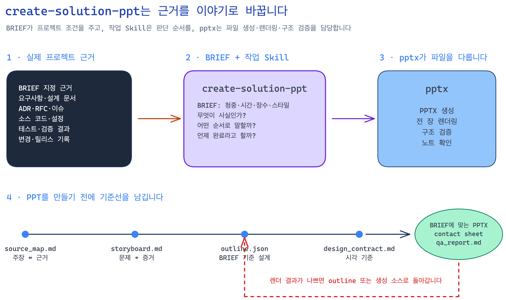
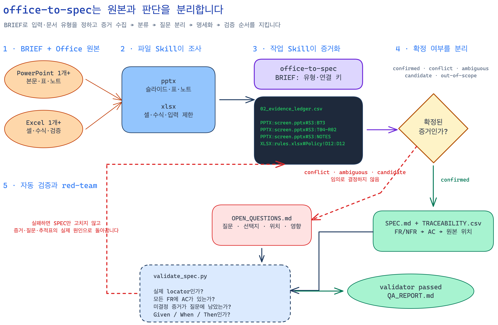

# Spec ↔ Office Skill 실습

이 저장소에서는 다음 두 Workflow를 순서대로 실행합니다.

```text
완성된 프로젝트 → PowerPoint
PowerPoint·Excel → 추적 가능한 Markdown SPEC
```

## 1. 저장소 준비

터미널에서 저장소를 복제합니다.

```bash
git clone https://github.com/rkdrn79/hanwha-agent-ai-day2-spec-workshop.git
cd hanwha-agent-ai-day2-spec-workshop
git switch student-workshop
```

준비 상태를 확인합니다.

```bash
python3 scripts/check_student_setup.py
```

결과의 `status`가 `passed`이면 Claude Code를 실행합니다.

```bash
claude
```

이후의 Prompt는 모두 저장소 루트에서 실행한 Claude Code에 순서대로 입력합니다.

## 2. Skill 구조 확인

이 저장소의 Skill은 두 층으로 나뉩니다.

```text
.claude/skills/
├─ create-solution-ppt/  # 프로젝트 근거를 발표 이야기로 구성
├─ office-to-spec/       # Office 증거를 분류하고 SPEC으로 변환
├─ pptx/                 # PowerPoint 파일 처리
└─ xlsx/                 # Excel 파일 처리
```

Skill 이름을 누르면 실행 지침인 `SKILL.md`를 바로 확인할 수 있습니다.

| Skill | 종류 | 실행 지침 |
|---|---|---|
| `create-solution-ppt` | 작업 Skill | [SKILL.md 열기](.claude/skills/create-solution-ppt/SKILL.md) |
| `office-to-spec` | 작업 Skill | [SKILL.md 열기](.claude/skills/office-to-spec/SKILL.md) |
| `pptx` | 외부 파일 Skill | [SKILL.md 열기](.claude/skills/pptx/SKILL.md) |
| `xlsx` | 외부 파일 Skill | [SKILL.md 열기](.claude/skills/xlsx/SKILL.md) |

<details>
<summary><code>create-solution-ppt</code> 구성 보기</summary>

- [실행 절차와 완료 조건](.claude/skills/create-solution-ppt/SKILL.md)
- [새 프로젝트용 Brief 템플릿](.claude/skills/create-solution-ppt/references/brief-template.md)
- [디자인 기준 체크리스트](.claude/skills/create-solution-ppt/references/design-contract.md)
- [스타일 레퍼런스](.claude/skills/create-solution-ppt/assets/lecture-style-reference.png)
- [현재 예제 Brief](presentation/BRIEF.md)

</details>

<details>
<summary><code>office-to-spec</code> 구성 보기</summary>

- [실행 절차와 완료 조건](.claude/skills/office-to-spec/SKILL.md)
- [새 프로젝트용 Brief 템플릿](.claude/skills/office-to-spec/references/brief-template.md)
- [문서 프로필](.claude/skills/office-to-spec/references/document-profiles.md)
- [증거 분류 규칙](.claude/skills/office-to-spec/references/evidence-rules.md)
- [SPEC 템플릿](.claude/skills/office-to-spec/references/spec-template.md)
- [Office 증거 추출 Script](.claude/skills/office-to-spec/scripts/extract_office_evidence.py)
- [SPEC 검증 Script](.claude/skills/office-to-spec/scripts/validate_spec.py)
- [Script 테스트](.claude/skills/office-to-spec/tests/test_scripts.py)
- [현재 예제 Brief](reverse-spec/BRIEF.md)

</details>

<details>
<summary><code>pptx</code> 구성 보기</summary>

- [PowerPoint 처리 지침](.claude/skills/pptx/SKILL.md)
- [라이선스](.claude/skills/pptx/LICENSE.txt)
- [슬라이드 미리보기 Script](.claude/skills/pptx/scripts/thumbnail.py)
- [PowerPoint 구조 검증 Script](.claude/skills/pptx/scripts/office/validate.py)

</details>

<details>
<summary><code>xlsx</code> 구성 보기</summary>

- [Excel 처리 지침](.claude/skills/xlsx/SKILL.md)
- [라이선스](.claude/skills/xlsx/LICENSE.txt)
- [수식 재계산 Script](.claude/skills/xlsx/scripts/recalc.py)
- [Excel 구조 검증 Script](.claude/skills/xlsx/scripts/office/validate.py)

</details>

| 구분 | 역할 |
|---|---|
| 작업 Skill | 무엇을 조사하고 어떤 순서로 판단하며 언제 완료할지 정의 |
| 파일 Skill | PPTX·XLSX를 실제로 읽고 생성하고 검증 |
| `BRIEF.md` | 이번 프로젝트의 입력·청중·문서 유형·출력 조건 전달 |

```text
사용자 Prompt + 프로젝트 BRIEF
                ↓
작업 Skill: 조사·판단·금지사항·완료 조건
                ↓
파일 Skill과 Script: 파일 처리·추출·검증
                ↓
결과 QA
    ├─ 실패 → 원인이 있는 단계로 복귀
    └─ 통과 → 완료
```

### Prompt 0 — Skill 역할 확인

```text
이 저장소의 create-solution-ppt, office-to-spec, pptx, xlsx Skill을 확인해줘.

각 Skill이 담당하는 역할과 서로 연결되는 순서를 간단히 설명해줘.
presentation/BRIEF.md와 reverse-spec/BRIEF.md가
Skill과 어떻게 결합되는지도 설명해줘.

아직 파일을 생성하거나 수정하지 마.
```

## 3. Project → PowerPoint

완성된 예제 프로젝트의 문서·소스·테스트를 근거로 편집 가능한 발표자료를 만듭니다.

- 프로젝트별 조건: [`presentation/BRIEF.md`](presentation/BRIEF.md)
- 작업 설명: [`presentation/README.md`](presentation/README.md)



작동 순서:

```text
프로젝트 근거
    ↓
source_map.md       주장과 실제 근거 연결
    ↓
storyboard.md       이야기 순서 설계
    ↓
outline.json        슬라이드별 결론·시각 요소·노트
    ↓
design_contract.md  디자인·가독성 기준
    ↓
pptx Skill          PPTX 생성·렌더링·구조 검증
    ↓
QA                   문제 발견 시 outline 또는 생성 소스로 복귀
```

### Prompt 1 — 발표자료 전체 생성

```text
create-solution-ppt와 pptx Skill을 사용해줘.

presentation/BRIEF.md를 이번 작업의 설정으로 사용해.
Brief에 지정된 프로젝트 범위와 근거 위치를 실제로 조사하고,
청중·목적·발표 시간·슬라이드 수·스타일·출력 조건을 따라줘.

PPT를 만들기 전에 Brief와 실제 style reference를 확인해.
presentation/work에 다음 기준선을 먼저 만들어.
- source_map.md
- storyboard.md
- outline.json
- design_contract.md

각 주장에 실제 근거 파일 위치를 연결하고,
한 장에는 가능한 한 하나의 결론만 보여줘.
제목만 읽어도 전체 이야기가 이어지게 구성하고
원본에 없는 효과·일정·비용·완료 상태는 만들지 마.

구성안에서 멈추지 말고 다음까지 완료해.
1. 편집 가능한 PPTX 생성
2. 전 슬라이드 PNG 렌더링과 contact sheet 생성
3. 사실·구조·시각·스타일·접근성 검수
4. 문제 발견 시 outline 또는 생성 소스 수정 후 전체 재생성
5. Office 구조 검증과 qa_report.md 작성

최종 결과는 presentation/BRIEF.md가 지정한 경로와 파일명으로 저장해.
```

완료되면 다음 파일을 확인합니다.

```text
presentation/work/
├─ source_map.md
├─ storyboard.md
├─ outline.json
└─ design_contract.md

presentation/output/
├─ ips_wbs_solution_brief.pptx
├─ contact_sheet.png
└─ qa_report.md
```

### Prompt 2 — 발표자료 Self-refinement

```text
create-solution-ppt와 pptx Skill로 방금 만든 발표자료를 self-refinement해줘.

source_map, contact sheet, 개별 슬라이드를 실제로 대조해 다음을 검사해.
- 핵심 주장과 숫자가 실제 근거와 일치하는가
- 제목만 읽어도 논리가 이어지는가
- 한 장에 결론이 과도하게 섞이지 않았는가
- 작은 글씨·겹침·잘림·어색한 줄바꿈이 없는가
- presentation/BRIEF.md의 스타일과 접근성 기준을 지켰는가

문제가 있으면 완성된 PPTX를 직접 덧대지 말고
outline 또는 생성 소스를 수정해 전체 생성·렌더링·검증을 다시 실행해.
qa_report.md에 수정 내용과 최종 검증 결과를 남겨.
```

## 4. Office → SPEC

예제 PowerPoint와 Excel에서 구현 가능한 요구사항을 복원합니다.

- 프로젝트별 조건: [`reverse-spec/BRIEF.md`](reverse-spec/BRIEF.md)
- PowerPoint 입력: [`roomflow_screen_definition.pptx`](reverse-spec/input/roomflow_screen_definition.pptx)
- Excel 입력: [`roomflow_function_definition.xlsx`](reverse-spec/input/roomflow_function_definition.xlsx)
- 입력 미리보기: [`reverse-spec/README.md`](reverse-spec/README.md)



작동 순서:

```text
PPTX·XLSX 원본
    ↓
source inventory + evidence ledger
    ↓
confirmed / conflict / ambiguous / candidate / out-of-scope
    ├─ 미결정 증거 → OPEN_QUESTIONS.md
    └─ confirmed → SPEC.md + TRACEABILITY.csv
                              ↓
                        validate_spec.py
                 실패 → 원인이 있는 단계로 복귀
```

원본 위치는 파일명과 실제 블록·표 행·노트·셀 범위까지 기록합니다.

```text
PPTX:screen.pptx#S3:B07
PPTX:screen.pptx#S3:T04-R02
PPTX:screen.pptx#S3:NOTES
XLSX:rules.xlsx#Policy!A5:J5
```

### Prompt 3 — Office 증거 수집

```text
office-to-spec, pptx, xlsx Skill을 사용해줘.

reverse-spec/BRIEF.md를 이번 작업의 설정으로 사용해.
Brief에 지정된 모든 PowerPoint 장과 Excel 시트를 조사해.
아직 SPEC은 작성하지 마.

1. office-to-spec의 extract_office_evidence.py를 실행해.
2. PPT를 렌더링하고 본문·표·발표자 노트를 확인해.
3. Excel의 값·수식·주석·데이터 검증·숨김 시트를 확인해.
4. PPT 본문·표 행·노트를 파일명이 포함된 locator로 분리해.
5. Excel은 파일명·시트·셀 범위를 기록하고 수식과 검증 흔적을 보존해.

01_source_inventory.md와 02_evidence_ledger.csv를
reverse-spec/output에 저장하고 멈춰.
```

중간 확인:

- `01_source_inventory.md`에 두 입력 파일과 전체 조사 범위가 보이는가
- `02_evidence_ledger.csv`의 각 행에 실제 locator가 있는가
- PPT 본문·표 행·노트가 서로 다른 증거로 분리됐는가
- Excel 수식과 데이터 검증 흔적이 보존됐는가

### Prompt 4 — 충돌과 미결정 내용 분리

```text
office-to-spec의 evidence rules와 reverse-spec/BRIEF.md의 문서 프로필을 적용해
02_evidence_ledger.csv의 모든 증거를 다음 상태로 분류해줘.

confirmed, conflict, ambiguous, candidate, out-of-scope

모든 행의 classification과 normalized_claim을 채우고 빈 행을 남기지 마.
PPT와 Excel 중 하나를 임의로 우선하지 마.
새로운 숫자·상태·오류 코드·권한·성능 목표를 만들지 마.

conflict, ambiguous, candidate는 다음 정보와 함께
reverse-spec/output/OPEN_QUESTIONS.md로 분리해.
- 질문
- 선택 가능한 해석
- 각 해석의 실제 원본 locator
- 결정에 따른 구현·검증 영향

분류와 질문 분리까지 완료한 뒤 멈춰.
```

중간 확인:

- evidence ledger에 빈 `classification`이 없는가
- `confirmed`가 아닌 증거를 임의로 확정하지 않았는가
- 미결정 증거의 locator가 `OPEN_QUESTIONS.md`에 남아 있는가

### Prompt 5 — SPEC 작성과 검증

```text
office-to-spec의 spec template을 사용해
confirmed 증거만으로 SPEC.md와 TRACEABILITY.csv를 작성해줘.

기능 요구사항은 FR-001부터,
비기능 요구사항은 NFR-001부터,
인수 조건은 AC-001부터 부여해.

각 AC에 검증 대상 FR/NFR ID를 쓰고
모든 FR을 하나 이상의 Given/When/Then AC에 연결해.
모든 FR/NFR/AC를 실제 evidence locator와 구체적인 검증 방법에 연결해.
미결정 증거를 확정 요구사항에 섞지 마.

SPEC, TRACEABILITY.csv, OPEN_QUESTIONS.md,
02_evidence_ledger.csv를 validate_spec.py로 함께 검사해.

그다음 원본을 다시 대조해 누락·추정·충돌 은폐를 검토하고,
validator가 passed일 때만 QA_REPORT.md와 함께 완료해.
모든 결과는 reverse-spec/output에 저장해.
```

완료되면 다음 파일을 확인합니다.

```text
reverse-spec/output/
├─ 01_source_inventory.md
├─ 02_evidence_ledger.csv
├─ SPEC.md
├─ TRACEABILITY.csv
├─ OPEN_QUESTIONS.md
└─ QA_REPORT.md
```

필요하면 검증기를 다시 직접 실행합니다.

```bash
python3 .claude/skills/office-to-spec/scripts/validate_spec.py \
  --spec reverse-spec/output/SPEC.md \
  --traceability reverse-spec/output/TRACEABILITY.csv \
  --questions reverse-spec/output/OPEN_QUESTIONS.md \
  --evidence reverse-spec/output/02_evidence_ledger.csv
```

## 5. 핵심 정리

```text
Skill  = 반복해서 사용하는 작업 절차
BRIEF  = 이번 프로젝트의 입력과 조건
Script = 반복 가능한 추출과 검증
```

- `create-solution-ppt`는 무엇을 발표할지 결정하고 `pptx`가 실제 파일을 만듭니다.
- `office-to-spec`은 증거를 분류하고 `pptx`·`xlsx`가 실제 Office 파일을 조사합니다.
- Claude는 의미·이야기·충돌을 판단하고 Script는 추출 누락과 추적성을 검사합니다.
- 다른 프로젝트에서는 Skill을 유지하고 Brief의 경로·청중·문서 프로필·출력 조건만 교체합니다.

Brief 템플릿:

- [Project → PowerPoint Brief](.claude/skills/create-solution-ppt/references/brief-template.md)
- [Office → SPEC Brief](.claude/skills/office-to-spec/references/brief-template.md)
