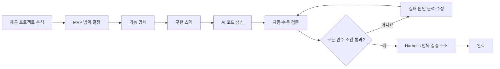

# 스펙으로 완성하는 사내추첨 MVP 실전

한화 Agent AI 실무교육 2일차 토이 프로젝트입니다. 제공된 **사내추첨시스템**을 업무 배경으로 삼아, 큰 운영 시스템에서 가장 작은 핵심 기능을 골라 **스펙 작성 → AI 생성 → 검증 → 수정·고도화** 사이클을 완주합니다.

실제 참고 시스템은 인증, API Gateway, 이벤트, 블록체인 연계, 사용자 웹, 관리자 웹으로 구성되어 있습니다. 교육에서는 이 전체를 재현하지 않고 다음 수직 흐름 하나를 완성합니다.

```text
참여자 입력 → 입력 정리·검증 → 무작위 추첨 → 결과 표시 → 실행 이력 확인
```

> 핵심은 “AI에게 잘 만들어 달라고 요청하는 법”이 아닙니다. 무엇을 만들지, 무엇을 만들지 않을지, 어떤 결과가 나오면 완료인지 스펙으로 고정하는 연습입니다.

---

## 목차

- [1. 실습 목표와 결과물](#1-실습-목표와-결과물)
- [2. 제공 프로젝트에서 MVP 범위 찾기](#2-제공-프로젝트에서-mvp-범위-찾기)
- [3. 전체 실습 흐름](#3-전체-실습-흐름)
- [4. 도구의 역할](#4-도구의-역할)
- [5. 프로젝트 폴더 구조](#5-프로젝트-폴더-구조)
- [6. Part 1: 사내추첨 MVP 완주](#6-part-1-사내추첨-mvp-완주)
  - [6.1 제공 프로젝트 분석](#61-제공-프로젝트-분석)
  - [6.2 가장 작은 MVP 범위 결정](#62-가장-작은-mvp-범위-결정)
  - [6.3 기능 명세 작성](#63-기능-명세-작성)
  - [6.4 AI가 구현할 수 있는 스펙 작성](#64-ai가-구현할-수-있는-스펙-작성)
  - [6.5 스펙 기반 AI 코드 생성](#65-스펙-기반-ai-코드-생성)
  - [6.6 자동·수동 검증](#66-자동수동-검증)
  - [6.7 실패 원인 기반 수정](#67-실패-원인-기반-수정)
  - [6.8 Harness로 반복 검증 구조 만들기](#68-harness로-반복-검증-구조-만들기)
- [7. 120분 권장 진행안](#7-120분-권장-진행안)
- [8. 단계별 통과 기준](#8-단계별-통과-기준)
- [9. 자주 하는 실수](#9-자주-하는-실수)
- [10. 마지막 체크리스트](#10-마지막-체크리스트)

---

## 1. 실습 목표와 결과물

### 학습 목표

실습을 마치면 다음을 할 수 있어야 합니다.

1. 큰 기존 시스템에서 교육용 MVP의 핵심 흐름 하나를 고릅니다.
2. 모호한 요청에서 업무 담당자가 결정해야 할 질문을 찾아냅니다.
3. 요구사항을 입력, 처리 규칙, 출력, 오류, 제외 범위로 나눕니다.
4. 완료 조건을 인수 조건과 테스트로 표현합니다.
5. AI 생성 결과를 느낌이 아니라 스펙 ID와 검증 결과로 평가합니다.
6. 테스트를 약화하지 않고 실패의 근본 원인을 수정합니다.
7. 같은 검증 절차를 반복할 수 있도록 Harness와 Skills로 남깁니다.

### 결과물

| 결과물 | 역할 | 위치 |
|---|---|---|
| 참고 프로젝트 분석 | 실제 시스템과 교육용 MVP의 차이 정리 | `docs/참고 프로젝트 분석.md` |
| 기능 명세 | 사용자, 문제, 핵심 흐름, 범위 정리 | `docs/사내추첨 MVP 기능명세.md` |
| 구현 스펙 | 입출력, 규칙, 오류, 인수 조건, 검증 기준 | `docs/사내추첨 MVP 구현스펙.md` |
| 스펙 작성 가이드 | 다른 업무에도 재사용할 작성 절차 | `docs/스펙 작성 가이드.md` |
| 스펙 템플릿 | 수강생 프로젝트용 빈 양식 | `docs/스펙 템플릿.md` |
| MVP 소스 코드 | 로컬에서 실행되는 사내추첨 웹 앱 | `src/` |
| 자동 테스트 | 인수 조건을 실행 가능한 기준으로 표현 | `tests/` |
| Harness 구성 | 반복 검증용 에이전트와 Skills | `.claude/agents/`, `.claude/skills/` |

---

## 2. 제공 프로젝트에서 MVP 범위 찾기

제공 자료의 사내추첨시스템은 운영 환경을 고려한 큰 시스템입니다.

| 구성 | 제공 자료에서의 역할 | 교육 MVP 판단 |
|---|---|---|
| `auth` | 로그인, 사용자 인증 | 제외 |
| `gateway` | 서비스 API 진입점 | 제외 |
| `event` | 이벤트, 응모, 추첨, 당첨자 처리 | 핵심 규칙만 축소 |
| `blockchain_gw` | 토큰·블록체인 연계 | 제외 |
| `lottery-web` | 사용자 화면 | 단일 화면으로 축소 |
| `lottery-webadmin` | 이벤트·당첨 관리자 화면 | 제외 |
| `api-docs` | 서비스별 API 설명 | 입출력 스펙 작성 시 참고 |

실제 시스템 구조를 그대로 복제하면 설치와 연동에 대부분의 시간을 쓰게 됩니다. 이번 실습에서는 `event` 영역의 **추첨 규칙**과 사용자 화면의 **입력·결과 확인**만 남깁니다.

### 교육 MVP의 한 줄 정의

> 행사 진행자가 참여자 이름과 당첨자 수를 입력하면, 시스템이 유효성을 검사하고 중복 없는 당첨자를 무작위로 뽑아 결과와 실행 이력을 보여 준다.

### 포함 범위

- 참여자 이름을 한 줄에 한 명씩 직접 입력
- 공백·빈 줄 제거와 동일 이름 중복 제거
- 당첨자 수 검증
- 중복 당첨 없는 무작위 추첨
- 테스트용 시드를 통한 결과 재현
- 결과 요약과 최근 실행 이력 확인

### 제외 범위

- 로그인과 조직 계정 연동
- 이벤트 생성·게시·응모 기간 관리
- 사용자별 온라인 응모와 취소
- Excel·CSV 업로드
- 블록체인·토큰·NFT 연계
- 사용자 웹과 관리자 웹 분리
- 데이터베이스와 영구 저장
- 알림, 재추첨, 당첨 포기 처리
- 운영 배포와 다중 서버 구성

제외 범위는 “나중에 해도 되는 기능 목록”이 아니라, 이번 MVP에서 AI가 임의로 만들지 않아야 하는 경계입니다.

---

## 3. 전체 실습 흐름



| 단계 | 핵심 질문 | 산출물 |
|---|---|---|
| 분석 | 실제 시스템에서 어떤 업무 흐름을 가져올 것인가? | 참고 프로젝트 분석 |
| 범위 | 이번 수업에서 어디까지 만들 것인가? | 포함·제외 범위 |
| 명세 | 누가 왜 어떤 기능을 쓰는가? | 기능 명세 |
| 스펙 | 정확히 어떻게 동작하고 언제 완료인가? | 구현 스펙·인수 조건 |
| 생성 | AI가 스펙을 그대로 구현했는가? | 소스 코드 |
| 검증 | 기대 결과와 실제 결과가 같은가? | 테스트·실패 보고서 |
| 수정 | 실패의 근본 원인은 무엇인가? | 수정 코드·회귀 테스트 |
| 고도화 | 다음에도 같은 검증을 반복할 수 있는가? | Agents·Skills |

---

## 4. 도구의 역할

특정 도구 이름보다 역할 분리가 중요합니다.

| 역할 | 하는 일 | 하지 않는 일 |
|---|---|---|
| 대화형 AI | 요구사항 질문, 기능 명세·스펙 초안 | 미결정 업무 규칙을 임의 확정하지 않음 |
| AI 코딩 도구 | 저장소를 읽고 코드·테스트 생성 | 스펙에 없는 기능을 임의 추가하지 않음 |
| 테스트 도구 | 인수 조건과 실제 결과 비교 | 기대값을 구현에 맞춰 낮추지 않음 |
| Harness | 역할별 검토와 반복 검증 절차 구성 | 에이전트 수만 늘리지 않음 |
| 사람 | 업무 규칙 결정, 실패 해석, 최종 승인 | AI 결과를 검증 없이 확정하지 않음 |

---

## 5. 프로젝트 폴더 구조

기존 저장소의 단순한 구조를 유지하고, MVP 개발과 검증에 필요한 폴더만 사용합니다.

```text
JB/
├── README.md
├── docs/
│   ├── 참고 프로젝트 분석.md
│   ├── 사내추첨 MVP 기능명세.md
│   ├── 사내추첨 MVP 구현스펙.md
│   ├── 스펙 작성 가이드.md
│   └── 스펙 템플릿.md
├── src/
│   ├── README.md
│   ├── app.py
│   ├── engine.py
│   ├── store.py
│   ├── data.py
│   ├── index.html
│   └── requirements.txt
├── tests/
│   ├── test_engine.py
│   └── test_api.py
└── .claude/                  # Harness 실행 후 생성
    ├── agents/
    └── skills/
```

| 폴더 | 역할 |
|---|---|
| `docs/` | 코드 생성과 검증의 기준 자료 |
| `src/` | 실행 가능한 MVP |
| `tests/` | 구현 스펙의 인수 조건을 검증하는 코드 |
| `.claude/` | 반복 가능한 검증·수정 절차 |

---

## 6. Part 1: 사내추첨 MVP 완주

### 6.1 제공 프로젝트 분석

> 이번 단계에서 할 일: 제공 자료의 전체 구조를 이해하고, 수업에서 가져올 업무 흐름과 제외할 기술 요소를 분리합니다.

먼저 “어떤 기술로 만들었는가”보다 “사용자가 어떤 일을 끝내는가”를 찾습니다.

#### 분석 질문

- 사용자는 누구인가?
- 사용자가 시작하는 행동은 무엇인가?
- 완료됐다고 판단하는 결과는 무엇인가?
- 핵심 업무 규칙은 어느 서비스에 있는가?
- 외부 시스템이 없어도 시뮬레이션할 수 있는가?
- 정상·오류 결과를 수업 시간 안에 확인할 수 있는가?

분석 결과는 [참고 프로젝트 분석](docs/참고%20프로젝트%20분석.md)에 정리되어 있습니다.

### 6.2 가장 작은 MVP 범위 결정

> 이번 단계에서 할 일: 기능을 여러 개 고르는 대신 입력부터 결과까지 닫힌 수직 흐름 하나를 선택합니다.

좋은 첫 MVP는 다음 조건을 만족합니다.

| 선택 기준 | 사내추첨 핵심 기능 |
|---|---|
| 입력이 단순한가 | 참여자 목록과 당첨자 수 |
| 결과가 눈에 보이는가 | 당첨자 명단과 요약 정보 |
| 외부 연동 없이 실행 가능한가 | 로컬 메모리만으로 가능 |
| 성공·실패를 판정할 수 있는가 | 인원수, 중복, 오류 메시지 확인 가능 |
| 경계값이 있는가 | 빈 입력, 중복, 0명, 참여자보다 많은 당첨자 |
| 재현 가능한가 | 테스트에서 시드 사용 가능 |

#### 범위 결정 프롬프트

```text
docs/참고 프로젝트 분석.md를 읽고 2시간 안에 완주할 수 있는 MVP 핵심 흐름 1개를 제안해줘.

출력:
- 사용자와 해결할 문제
- 시작 입력과 최종 결과
- 포함 범위
- 제외 범위
- 정상·오류·경계 시나리오
- 이 범위가 2시간 실습에 적합한 이유

아직 코드나 상세 스펙은 작성하지 마.
```

### 6.3 기능 명세 작성

> 이번 단계에서 할 일: 서비스 전체 제안서가 아니라, 선택한 MVP가 해결할 문제와 사용자 흐름을 1~2페이지로 설명합니다.

기능 명세는 다음 항목만 명확하면 충분합니다.

1. 배경과 문제
2. 대상 사용자
3. 핵심 사용자 흐름
4. 주요 기능
5. 포함·제외 범위
6. 완료 모습

예시는 [사내추첨 MVP 기능명세](docs/사내추첨%20MVP%20기능명세.md)를 참고합니다.

#### 기능 명세 생성 프롬프트

```text
docs/참고 프로젝트 분석.md와 확정된 MVP 범위를 읽고 사내추첨 MVP 기능 명세를 작성해줘.

포함할 내용:
- 배경과 해결할 문제
- 대상 사용자
- 사용자 흐름
- 주요 기능
- 포함 범위와 제외 범위
- MVP 완료 모습

구현 방법이나 코드 세부사항보다 업무 흐름을 중심으로 작성하고,
결정되지 않은 규칙은 추정하지 말고 '결정 필요'로 표시해줘.
결과는 docs/사내추첨 MVP 기능명세.md에 저장해줘.
```

### 6.4 AI가 구현할 수 있는 스펙 작성

> 이번 단계에서 할 일: 기능 명세를 입력·처리·출력·오류·인수 조건으로 구체화합니다.

기능 명세가 “무엇을 왜 만드는가”를 설명한다면, 구현 스펙은 “정확히 어떻게 동작하고 언제 완료인가”를 정의합니다.

#### 스펙에 반드시 들어갈 8가지

| 항목 | 작성할 내용 | 사내추첨 예시 |
|---|---|---|
| 목표 | 사용자와 해결할 문제 | 행사 진행자의 수기 추첨 부담 감소 |
| 범위 | 포함·제외 기능 | 직접 입력 포함, 로그인 제외 |
| 입력 | 형식, 필수 여부, 제한 | 한 줄에 이름 1명, 당첨자 수 정수 |
| 처리 규칙 | 판단 순서와 기준 | 공백 제거 → 빈 줄 제거 → 중복 제거 → 수 검증 → 추첨 |
| 출력 | 반환 필드와 화면 표시 | 고유 참여자 수, 중복 수, 당첨자 수, 당첨자 |
| 오류 | 잘못된 값과 메시지 | 당첨자 수가 참여자보다 많으면 거부 |
| 인수 조건 | 구체적 입력과 기대 결과 | `AC-05` 상한 오류 |
| 검증 | 자동·수동 재현 방법 | 단위 테스트와 브라우저 시나리오 |

상세 작성 절차는 [스펙 작성 가이드](docs/스펙%20작성%20가이드.md), 복사용 양식은 [스펙 템플릿](docs/스펙%20템플릿.md), 완성 예시는 [사내추첨 MVP 구현스펙](docs/사내추첨%20MVP%20구현스펙.md)에 있습니다.

#### 모호한 요청을 결정 가능한 질문으로 바꾸기

```text
모호한 요청: "직원 이름을 넣고 공정하게 랜덤으로 뽑아 주세요."
```

| 모호한 표현 | 결정할 질문 |
|---|---|
| 직원 이름 | 입력 형식은 줄바꿈인가, 파일인가? |
| 같은 사람 | 중복 이름은 한 명인가, 응모권 여러 장인가? |
| 공정하게 | 한 번의 추첨에서 중복 당첨을 금지하는가? |
| 랜덤 | 자동 테스트에서 결과를 어떻게 재현하는가? |
| 당첨자 수 | 참여자보다 많으면 자동 보정하는가, 오류로 막는가? |
| 결과 | 어떤 필드를 반환해야 완료를 검증할 수 있는가? |

#### 좋은 인수 조건

```text
AC-05 당첨자 수 상한 오류

Given 고유 참여자가 2명이고
And 당첨자 수가 3명이며
When 추첨을 실행하면
Then 추첨 결과를 생성하지 않고
And "당첨자 수는 참여자 수보다 많을 수 없습니다."를 반환한다.
```

“정확하게 추첨한다”, “오류 없이 동작한다”처럼 제3자가 판정할 수 없는 표현은 사용하지 않습니다.

#### 스펙 작성 프롬프트

```text
docs/사내추첨 MVP 기능명세.md를 읽고 AI와 개발자가 바로 구현할 수 있는 스펙으로 구체화해줘.

코드는 아직 작성하지 마.

반드시 포함할 내용:
1. 목표와 사용자
2. 포함 범위와 제외 범위
3. 입력 필드, 형식, 필수 여부, 제한, 예시
4. 처리 순서와 업무 규칙
5. 출력 필드와 의미
6. 오류·빈 값·경계값 처리와 정확한 메시지
7. Given-When-Then 형식의 인수 조건
8. 스펙 ID와 테스트를 연결한 검증 매트릭스

요구사항에는 FR/ER/NFR, 인수 조건에는 AC ID를 붙여줘.
모호한 내용은 임의로 결정하지 말고 '결정 필요'로 분리해줘.
결과는 docs/사내추첨 MVP 구현스펙.md에 저장해줘.
```

#### 코드 생성 전 리뷰 게이트

- [ ] 입력부터 결과까지 한 문장으로 설명할 수 있습니다.
- [ ] 포함·제외 범위가 분리되어 있습니다.
- [ ] 처리 규칙의 순서가 정해져 있습니다.
- [ ] 오류를 자동 보정할지 거부할지 결정했습니다.
- [ ] 모든 요구사항과 인수 조건에 ID가 있습니다.
- [ ] 인수 조건에 실제 입력과 기대 결과가 있습니다.
- [ ] 각 인수 조건에 자동 또는 수동 검증 방법이 연결되어 있습니다.
- [ ] 결정 필요 항목이 남아 있으면 업무 담당자에게 확인했습니다.

### 6.5 스펙 기반 AI 코드 생성

> 이번 단계에서 할 일: 승인된 스펙만 구현하고, 스펙 밖의 기능은 추가하지 않습니다.

```text
다음 파일을 끝까지 읽고 사내추첨 MVP를 구현해줘.
- docs/사내추첨 MVP 기능명세.md
- docs/사내추첨 MVP 구현스펙.md
- src/README.md

바로 코드를 수정하지 말고 먼저 아래를 보고해줘.
1. 구현할 FR/ER/NFR/AC 목록
2. 모호하거나 충돌하는 조건
3. 수정할 파일과 수정하지 않을 파일
4. 검증 명령

그 다음 구현해줘.
- 스펙에 없는 기능은 추가하지 마.
- 업무 규칙은 src/engine.py에 모아줘.
- API와 화면에 같은 규칙을 중복 구현하지 마.
- 각 인수 조건에 대응하는 테스트를 작성해줘.
- 테스트 기대값을 구현 결과에 맞춰 낮추지 마.
- 완료 후 인수 조건별 검증 결과를 보고해줘.
```

#### 코드 생성 후 확인할 것

| 확인 항목 | 완료 기준 |
|---|---|
| 실행 가능성 | `src/README.md`만 보고 실행 가능 |
| 범위 준수 | 인증·DB·블록체인 등 제외 기능이 추가되지 않음 |
| 규칙 위치 | 핵심 규칙이 화면·API와 분리되어 자동 테스트 가능 |
| 추적성 | 테스트 이름 또는 설명에서 AC ID 확인 가능 |
| 재현성 | 같은 입력과 시드로 같은 테스트 결과 확인 가능 |

### 6.6 자동·수동 검증

> 이번 단계에서 할 일: 생성 결과를 스펙의 인수 조건과 비교하고 실패 증거를 남깁니다.

#### 자동 검증

```bash
python -m unittest discover -s tests -v
```

#### 화면 실행

```bash
python -m venv .venv
source .venv/bin/activate
python -m pip install -r src/requirements.txt
python src/app.py
```

브라우저에서 `http://127.0.0.1:8000`을 엽니다.

#### 검증 원칙

- 테스트 통과 여부만 보지 않고 어떤 AC와 연결되는지 확인합니다.
- 실패를 재현할 입력과 명령을 남깁니다.
- 랜덤 결과 자체가 아니라 인원수, 포함 관계, 중복 여부, 재현성을 검증합니다.
- 자동 테스트가 어려운 화면 메시지와 사용 흐름은 수동 체크리스트로 확인합니다.
- 실패를 숨기기 위해 테스트를 삭제하거나 기대값을 낮추지 않습니다.

#### 실패 기록 양식

```text
실패한 스펙 ID:
입력:
기대 결과:
실제 결과:
재현 명령:
추정 원인:
수정 대상:
```

### 6.7 실패 원인 기반 수정

> 이번 단계에서 할 일: 증상별 임시 처리가 아니라 공통 원인을 찾아 최소 범위만 수정합니다.

```text
검증 결과를 근거로 실패한 인수 조건만 수정해줘.

실패한 스펙 ID:
<AC ID>

실패 로그:
<테스트 출력>

수정 전에 다음을 설명해줘.
1. 실제 결과가 스펙의 어느 문장과 다른지
2. 여러 실패를 만드는 공통 원인이 있는지
3. 수정할 함수와 수정하지 않을 범위

제약:
- tests/의 기대값을 낮추거나 테스트를 삭제하지 마.
- 실패와 무관한 리팩터링을 하지 마.
- 잘못된 입력을 임의로 자동 보정하지 마.
- 스펙 변경이 필요하면 코드보다 먼저 변경 제안과 영향을 보고해줘.

수정 후 전체 테스트를 다시 실행하고 AC별 최종 상태를 보고해줘.
```

수정 후에는 실패했던 테스트만 실행하고 끝내지 않습니다. 전체 테스트를 다시 실행해 기존 정상 기능이 깨지지 않았는지 확인합니다.

### 6.8 Harness로 반복 검증 구조 만들기

> 이번 단계에서 할 일: 이번에 수행한 리뷰와 테스트 절차를 다음 수정에서도 반복할 수 있게 만듭니다.

Harness는 MVP 대신 코드를 만들어 주는 도구가 아니라, 문서·코드·테스트가 계속 같은 방향을 유지하는지 확인하는 작업 구조입니다.

#### 권장 에이전트 역할

| 역할 | 검증 내용 |
|---|---|
| `spec-reviewer` | 모호성, 충돌, 누락된 오류·경계값 |
| `implementation-reviewer` | 스펙과 코드의 일치, 제외 범위 침범 |
| `test-reviewer` | AC와 테스트의 연결, 누락 시나리오 |
| `mvp-gatekeeper` | 완료 정의 충족과 남은 위험 |

#### 권장 Skills

| Skill | 역할 |
|---|---|
| `spec-quality-check` | 구현 가능한 스펙인지 점검 |
| `spec-code-traceability` | FR/ER/NFR/AC와 코드·테스트 연결 |
| `acceptance-test-run` | 전체 테스트 실행과 실패 분류 |
| `failure-root-cause` | 실패 증거를 공통 원인으로 묶기 |
| `mvp-completion-gate` | 완료 기준 최종 점검 |

#### Harness 요청 프롬프트

```text
현재 프로젝트의 기능 명세, 구현 스펙, 소스 코드, 테스트를 읽고
"스펙 작성 → AI 생성 → 검증 → 수정" 루프를 반복할 수 있는 Harness를 구성해줘.

성공 기준:
- 스펙 품질, 구현 일치, 테스트 추적성, 완료 게이트 역할을 분리
- 모든 지적 사항에 파일, 스펙 ID, 근거 포함
- 테스트 실패 시 재현 방법과 수정 우선순위 제시
- 테스트를 약화하거나 제외 범위를 확장하지 않음
- 각 Skill에 입력, 실행 절차, 출력 형식, 중단 조건 포함

완료 후 생성한 agents와 skills 목록, 권장 실행 순서를 보고해줘.
```

---

## 7. 120분 권장 진행안

| 시간 | 단계 | 수강생 산출물 |
|---:|---|---|
| 0~15분 | 제공 프로젝트와 업무 흐름 이해 | As-Is 구성 요약 |
| 15~30분 | MVP 범위 결정 | 포함·제외 범위 |
| 30~55분 | 구현 스펙 작성·리뷰 | 요구사항과 인수 조건 |
| 55~75분 | AI 코드 생성 | 1차 구현 |
| 75~90분 | 자동·수동 검증 | 실패 보고서 |
| 90~110분 | 원인 기반 수정 | 테스트 통과 구현 |
| 110~120분 | Harness·회고 | 반복 검증 구조와 배운 점 |

시간이 부족하면 화면 꾸미기와 Harness 생성을 줄이고 **스펙 리뷰와 실패 해석**을 우선합니다.

---

## 8. 단계별 통과 기준

| 단계 | 다음 단계로 넘어가는 기준 |
|---|---|
| 프로젝트 분석 | 실제 구성과 교육 MVP에서 제외할 부분을 설명할 수 있음 |
| 범위 결정 | 사용자 입력부터 결과까지 수직 흐름 하나로 좁혀짐 |
| 기능 명세 | 사용자, 문제, 흐름, 포함·제외 범위가 있음 |
| 구현 스펙 | 입출력, 처리 순서, 오류, 인수 조건, 검증표가 있음 |
| AI 생성 | 스펙 밖 기능 없이 실행 가능한 코드와 테스트가 있음 |
| 검증 | 모든 AC에 자동 또는 수동 결과가 연결됨 |
| 수정 | 실패 원인과 수정 내용을 스펙 ID로 설명할 수 있음 |
| 완료 | 전체 테스트 통과, 화면 핵심 시나리오 확인, 미해결 위험 기록 |

---

## 9. 자주 하는 실수

| 실수 | 문제 | 해결 방법 |
|---|---|---|
| 제공 시스템 전체를 재구축 | 환경 구성만 하다 실습이 끝남 | 핵심 수직 흐름 하나만 선택 |
| “추첨 시스템 만들어 줘”로 시작 | 중복·오류·랜덤 규칙을 AI가 추정 | 코드 전에 구현 스펙 승인 |
| 기능 명세에서 바로 코드 생성 | 완료와 실패를 판정할 기준이 없음 | 인수 조건과 검증표 작성 |
| 제외 범위를 쓰지 않음 | 인증·DB·관리 화면이 불필요하게 추가됨 | 비목표를 명시적으로 기록 |
| 랜덤 결과값 하나를 정답으로 테스트 | 실행마다 결과가 달라짐 | 무결성 검증과 테스트 시드 사용 |
| 잘못된 당첨자 수를 자동 보정 | 업무 오류가 숨겨짐 | 스펙에 지정된 오류로 명시적 거부 |
| 실패 후 테스트를 수정 | 구현 오류가 기준 변경으로 가려짐 | 승인된 스펙 기준으로 코드 수정 |
| 부분 테스트만 재실행 | 다른 기능의 회귀 오류를 놓침 | 수정 후 전체 테스트 실행 |

---

## 10. 마지막 체크리스트

- [ ] 제공 사내추첨시스템의 구성과 교육용 축소 이유를 설명할 수 있습니다.
- [ ] 핵심 흐름이 참여자 입력부터 결과 확인까지 한 번에 이어집니다.
- [ ] 기능 명세에 포함 범위와 제외 범위가 있습니다.
- [ ] 구현 스펙에 FR, ER, NFR, AC ID가 있습니다.
- [ ] 입력, 처리 순서, 출력, 오류 메시지가 구체적입니다.
- [ ] 모든 인수 조건에 실제 입력과 기대 결과가 있습니다.
- [ ] 모든 인수 조건에 자동 또는 수동 검증 방법이 연결되어 있습니다.
- [ ] AI가 스펙 밖 기능을 추가하지 않았습니다.
- [ ] 자동 테스트가 모두 통과합니다.
- [ ] 정상, 중복, 빈 입력, 당첨자 수 오류를 화면에서 확인했습니다.
- [ ] 테스트를 삭제하거나 기대값을 낮추지 않았습니다.
- [ ] 수정 이유를 스펙 ID와 실패 증거로 설명할 수 있습니다.
- [ ] 남은 위험과 다음 확장 범위를 기록했습니다.

이 사이클을 한 번 완주하면, 다음 과제에서는 사내추첨 대신 구매 입출고, 재고 동기화, 과제 관리, VOC 조회 등 다른 제공 프로젝트의 핵심 흐름을 같은 방식으로 바꿔 실습할 수 있습니다.
