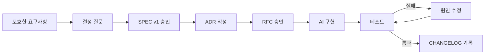

# SDD 문서 체계: SPEC · ADR · RFC · CHANGELOG

이 실습에서 SDD(Spec-Driven Development)는 “스펙을 계속 고치는 개발 방식”이 아닙니다. **개발 전에 목표와 경계를 문서로 고정하고, AI가 그 안에서만 구현하게 만든 뒤, 결과를 테스트와 변경이력으로 증명하는 방식**입니다.

## 1. 문서별 책임

| 문서 | 핵심 질문 | 작성 시점 | 승인 후 원칙 |
|---|---|---|---|
| `SPEC` | 무엇을 만들고 어떤 결과가 완료인가? | 최초 개발 전 | 초기 설계 기준선으로 보존 |
| `ADR` | 왜 이 설계 결정을 선택했는가? | 중요한 선택을 확정할 때 | 내용을 덮어쓰지 않고 새 ADR로 대체 |
| `RFC` | 이번 작업에서 AI가 무엇을 바꿔도 되는가? | 매 구현·수정 작업 전 | 승인된 범위 밖 작업 금지 |
| 테스트 | 구현이 SPEC의 완료 조건을 만족하는가? | 구현과 함께 | 인수 조건 ID와 연결 |
| `CHANGELOG.md` | 실제로 무엇이 추가·변경·수정되었는가? | 검증 완료 후 | 버전·날짜별 누적 |

### SPEC은 유지보수 일지가 아니다

승인된 SPEC v1은 최초 목표 상태를 설명하는 **설계 기준선**입니다. 오탈자나 명백한 오류를 제외하고, 구현할 때마다 내용을 덧붙이거나 현재 코드 상태에 맞춰 고치지 않습니다.

- 구현 세부 변경: `CHANGELOG.md`에 기록
- 작업 범위 변경: 새 RFC 작성
- 중요한 설계 판단 변경: 기존 ADR을 대체하는 새 ADR 작성
- 제품 계약·인수 조건 자체 변경: SPEC v2를 새 문서로 작성하고 다시 승인

이렇게 분리하면 “처음 무엇을 만들기로 했는지”와 “나중에 실제로 무엇이 바뀌었는지”를 동시에 확인할 수 있습니다.

## 2. 최초 개발 흐름



### 각 단계의 게이트

| 단계 | 다음 단계로 넘어가는 조건 |
|---|---|
| SPEC 승인 | 입력, 상태, 규칙, 오류, 인수 조건, 제외 범위가 결정됨 |
| ADR 승인 | 중요한 선택의 이유와 포기한 대안이 기록됨 |
| RFC 승인 | 수정 허용 파일, 금지 파일, 중단 조건, 검증 명령이 확정됨 |
| 구현 완료 | RFC 범위 안에서만 변경됨 |
| 검증 완료 | 관련 AC와 전체 회귀 테스트가 통과함 |
| 변경 종료 | 실제 변경 사항이 CHANGELOG에 기록됨 |

## 3. 유지보수 흐름

유지보수에서는 SPEC을 매 작업과 페어링하지 않습니다. 변경의 크기에 따라 필요한 문서만 추가합니다.

### 유형 A: SPEC 안의 버그 수정

예: 중복 취소 시 재고가 두 번 원복되는 오류

```text
새 RFC → 코드 수정 → 관련 AC와 회귀 테스트 → CHANGELOG
```

- SPEC 수정 없음
- 설계 결정이 바뀌지 않으면 ADR 없음

### 유형 B: 중요한 설계 결정 변경

예: 전체 취소만 허용하던 정책을 부분 취소 허용으로 변경

```text
새 ADR → 새 RFC → 코드·테스트 수정 → CHANGELOG
```

- 기존 ADR의 상태를 `Superseded`로 바꾸고 새 ADR을 연결
- SPEC의 제품 계약까지 달라진다면 유형 C로 처리

### 유형 C: 제품 범위·계약 변경

예: 로컬 메모리 MVP를 실제 SAP 연동 서비스로 확장

```text
SPEC v2 → 관련 ADR → RFC → 구현 → 테스트 → CHANGELOG
```

- SPEC v1을 삭제하거나 현재 구현에 맞춰 덮어쓰지 않음
- 새 SPEC의 적용 버전과 기준일을 명확히 기록

## 4. ADR: 결정 기록

ADR(Architecture Decision Record)은 회의록이나 작업일지가 아닙니다. 구현과 운영에 지속적인 영향을 주는 선택의 **맥락, 결정, 대안, 결과**를 기록합니다.

### ADR을 작성해야 하는 경우

- 데이터 저장 방식을 선택할 때
- 상태 모델이나 원자성 정책을 선택할 때
- 외부 시스템 연동 방식을 선택할 때
- 보안·개인정보·권한 경계를 결정할 때
- 이후 변경 비용이 큰 기술·업무 결정을 할 때

### ADR을 작성하지 않아도 되는 경우

- 변수명 변경
- 오탈자 수정
- 스펙 안에서 명백한 버그 수정
- 포맷팅과 주석 수정

### 상태

```text
Proposed → Accepted → Deprecated 또는 Superseded
```

Accepted ADR의 본문은 과거 판단을 보존합니다. 결정이 바뀌면 본문을 다시 쓰지 말고 새 ADR에서 이전 ADR을 대체합니다.

## 5. RFC: AI 작업 범위 규제안

이 실습의 RFC(Request for Comments)는 긴 기술 제안서보다 **AI 변경 계약**에 가깝습니다. AI가 선의로 범위를 넓히거나, 테스트를 바꾸어 통과하거나, 기존 구조를 리팩터링하는 일을 막습니다.

RFC에는 최소한 다음을 포함합니다.

1. 이번 작업의 단일 목적
2. 관련 SPEC·ADR·인수 조건 ID
3. 수정 허용 파일과 허용 작업
4. 읽기 전용 파일
5. 수정·삭제 금지 파일과 금지 작업
6. 의존성·데이터·보안 제약
7. AI가 멈추고 질문해야 하는 조건
8. 검증 명령과 완료 보고 형식

### RFC의 강한 표현 예시

좋지 않은 표현:

```text
가급적 기존 구조를 유지한다.
필요하면 테스트도 수정한다.
```

검증 가능한 표현:

```text
수정 허용 파일은 src/engine.py와 src/service.py뿐이다.
tests/, docs/, src/store.py는 읽기 전용이다.
테스트 삭제, skip 추가, 기대값 변경은 금지한다.
범위 밖 수정이 필요하면 작업을 중단하고 이유와 최소 변경안을 보고한다.
```

## 6. CHANGELOG: 실제 변경이력

CHANGELOG에는 계획이나 의사결정이 아니라 **검증을 마친 실제 변경**만 기록합니다.

권장 분류:

- `Added`: 새 기능·새 파일
- `Changed`: 기존 동작 변경
- `Fixed`: 스펙 대비 결함 수정
- `Removed`: 제거된 기능
- `Security`: 보안 관련 변경

각 항목은 가능하면 RFC, ADR, 스펙 ID를 연결합니다.

```markdown
## [Unreleased]

### Fixed

- 중복 취소 시 재고가 두 번 원복되는 문제 수정 (`AC-12`, `RFC-002`).
```

커밋 로그는 개발자의 작업 단위이고, CHANGELOG는 사용자가 이해할 수 있는 제품 변화입니다. 둘은 대체 관계가 아닙니다.

## 7. 문서 추적 예시

| 질문 | 연결 문서 |
|---|---|
| 무엇을 만들어야 하는가? | `docs/IPS MVP 구현스펙.md`의 `FR-01~10` |
| 왜 부분 출고를 허용하지 않는가? | `docs/ADR-001 출고와 취소의 원자성.md` |
| AI가 어느 파일을 수정할 수 있는가? | `docs/RFC-001 AI 구현 범위.md` |
| 구현이 맞는지 어떻게 아는가? | `tests/`와 `AC-01~13` |
| 실제로 무엇이 바뀌었는가? | `CHANGELOG.md` |

## 8. SDD 완료 체크리스트

- [ ] SPEC v1이 최초 목표와 인수 조건을 고정합니다.
- [ ] 중요한 결정마다 ADR이 있습니다.
- [ ] 구현 전 RFC가 AI의 수정 범위를 제한합니다.
- [ ] 테스트가 AC ID와 연결됩니다.
- [ ] AI가 RFC 밖의 변경이 필요할 때 멈추도록 규정했습니다.
- [ ] 실제 변경은 CHANGELOG에 기록합니다.
- [ ] 유지보수 작업마다 SPEC을 현재 코드에 맞춰 덮어쓰지 않습니다.
