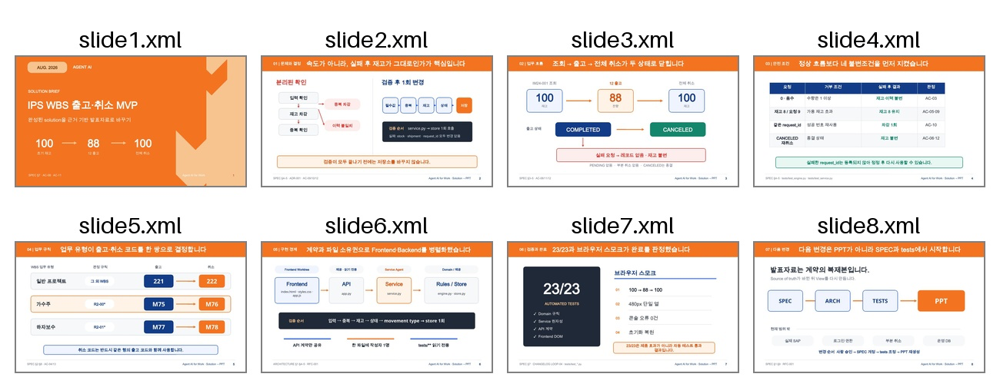

# 완성된 프로젝트를 PPT로 만드는 방법

이 실습의 목표는 Claude Code가 완성된 `solution`의 문서와 테스트를 읽고, **주장마다 근거가 연결된 편집 가능한 PowerPoint 전체**를 만들게 하는 것입니다.

```text
SPEC · Architecture · ADR · RFC · tests
                    ↓
             발표할 주장 선별
                    ↓
             8장 스토리 구성
                    ↓
           PPT 생성 → 렌더 → 수정
```

완성 예시:



## 1. 실습 브랜치 열기

터미널에서 저장소로 이동하고 실습 브랜치를 엽니다.

```bash
git switch solution-to-ppt-workshop
claude
```

이 브랜치에는 다음 두 Skill이 준비되어 있습니다.

- `create-solution-ppt`: 이 프로젝트의 문서와 테스트에서 발표 근거를 찾는 순서
- `pptx`: PPT 생성, 렌더링, 파일 구조 검증을 수행하는 공식 Skill

Skill 이름을 프롬프트에 직접 적어야 Claude Code가 단순한 구성안에서 멈추지 않고 실제 PPTX까지 만듭니다.

## 2. Claude Code에 제작을 요청하기

아래 프롬프트를 Claude Code에 그대로 붙여 넣습니다.

```text
이 저장소의 create-solution-ppt Skill과 pptx Skill을 사용해줘.

완성된 solution의 SPEC, Architecture, ADR, RFC, tests, CHANGELOG를 읽고
프로젝트·업무 리더가 5분 안에 이해할 수 있는 16:9 발표자료 8장을 만들어줘.

중요한 숫자, 상태, 업무 규칙은 반드시 원문과 테스트에서 대조하고
각 슬라이드 발표자 노트에 근거 파일 경로를 남겨줘.

presentation/source_map.md, presentation/storyboard.md,
presentation/outline.json을 승인된 제작 기준선으로 사용해.

원래 2일차 강연자료처럼 주황색 상단 바, 흰색 본문,
짙은 설명 패널과 파란 근거 도형을 사용해.

구성안만 작성하고 멈추지 말고 다음까지 모두 수행해줘.
1. 편집 가능한 PPTX 생성
2. 전 슬라이드 PNG 렌더링과 접촉 시트 생성
3. 겹침, 잘림, 작은 글씨, 어색한 줄바꿈 수정
4. Office 구조 검증
5. QA 보고서 작성

최종 파일은 presentation/output에 저장해줘.
```

더 엄격한 전체 프롬프트는 [`PPT_PROMPT.md`](PPT_PROMPT.md)에 있습니다.

## 3. Claude Code가 만드는 과정

### ① 발표 근거 찾기

소스 코드를 처음부터 모두 읽게 하지 않습니다. 다음 순서로 읽으면 발표에 필요한 의사결정과 검증 결과를 빠르게 찾을 수 있습니다.

```text
docs/SPEC.md
→ docs/ARCHITECTURE.md
→ docs/adr/ADR-001.md
→ docs/rfc/RFC-001.md
→ tests/test_*.py
→ CHANGELOG.md
→ 설명이 더 필요할 때만 src/
```

이 프로젝트에서는 다음과 같은 주장이 발표 근거가 됩니다.

| 발표에서 보여줄 주장 | 확인할 근거 |
|---|---|
| `100 → 88 → 100` | SPEC의 인수 조건 + 출고·취소 테스트 |
| `COMPLETED → CANCELED` | 상태 규칙 + 재취소 테스트 |
| 실패 시 변경 없음 | 원자성 규칙 + 오류 경로 테스트 |
| `23/23` | 전체 자동 테스트 결과 |

### ② 한 장에 하나의 결론 배치하기

파일 내용을 순서대로 요약하면 문서 보고서처럼 보입니다. 먼저 청중이 이해해야 하는 순서로 제목을 만들고, 그 아래에 근거를 배치합니다.

```text
1. 결론       100 → 88 → 100
2. 문제       분리된 확인은 중복 차감과 이력 불일치를 만든다
3. 업무 흐름  조회 → 출고 → 전체 취소
4. 핵심 결정  실패는 재고와 이력을 바꾸지 않는다
5. 규칙       WBS 유형별 이동유형 코드 쌍
6. 구조       Frontend와 Backend의 계약 경계
7. 검증       자동 테스트 23/23
8. 마무리     다음 변경도 SPEC과 테스트에서 시작한다
```

### ③ PPT를 렌더링하고 눈으로 고치기

PPTX가 생성됐다는 메시지만 믿지 않습니다. 모든 장을 이미지로 렌더링한 뒤 아래 항목을 확인하고, 문제가 있으면 생성 소스를 수정해 다시 만듭니다.

- 제목만 읽어도 이야기 흐름이 이어지는가
- 한 장에 핵심 메시지가 하나뿐인가
- 글자나 도형이 겹치거나 잘리지 않았는가
- 작은 본문과 어색한 줄바꿈이 없는가
- 실제 파일명·숫자·상태가 장식보다 먼저 보이는가

## 4. 결과 확인하기

Claude Code 작업이 끝나면 다음 세 파일이 있어야 합니다.

```text
presentation/output/
├─ ips_wbs_solution_brief.pptx  # 편집 가능한 발표자료
├─ contact_sheet.png            # 전 장을 한눈에 보는 검수 이미지
└─ qa_report.md                 # 사실·구조·시각·재생성 검수 결과
```

`ips_wbs_solution_brief.pptx`를 PowerPoint에서 열어 한글, 발표자 노트, 도형 편집 여부를 마지막으로 확인합니다.

## 5. 내용을 수정할 때

완성된 PPTX를 직접 고치게 하지 말고, 원천 파일을 고친 뒤 전체를 다시 생성하게 합니다.

```text
내용·문구 수정    → presentation/outline.json
레이아웃·스타일   → presentation/generator/build_solution_ppt.js
사실·업무 규칙    → 승인 문서와 tests를 먼저 확인
```

Claude Code 수정 요청 예시:

```text
같은 두 Skill을 사용해줘.
4번 슬라이드의 문장이 길어서 핵심이 늦게 보인다.
"실패는 재고와 이력을 바꾸지 않는다"가 먼저 보이도록 줄이고,
outline 또는 생성 소스를 수정한 뒤 PPT 전체를 다시 생성해줘.
수정한 장과 앞뒤 장을 렌더링해 확인하고 QA 보고서도 갱신해줘.
```

## 6. 생성 소스를 직접 실행할 때

Claude Code 없이 동일한 PPT를 다시 만들려면 다음을 실행합니다.

```bash
node presentation/generator/build_solution_ppt.js
```

`pptxgenjs` 모듈을 찾지 못하는 일반 로컬 환경에서는 한 번만 설치합니다.

```bash
cd presentation/generator
npm install
npm run build
```

## 핵심 원칙

좋은 `Spec → PPT` 작업은 디자인을 먼저 부탁하는 일이 아닙니다.

1. 발표할 주장을 먼저 정합니다.
2. 주장마다 문서 위치와 테스트를 연결합니다.
3. 한 장에 하나의 결론만 보여줍니다.
4. PPT를 렌더링해 사람이 직접 보듯 검수합니다.
5. 결과물이 아니라 원천 파일을 수정해 다시 생성합니다.
