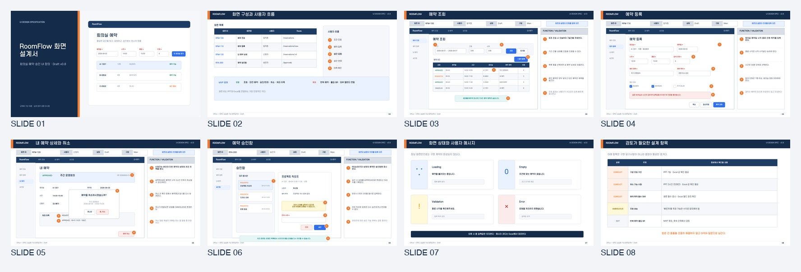
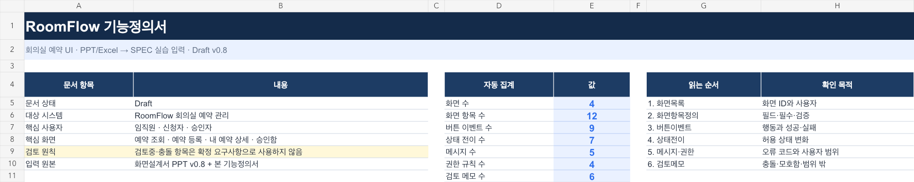

# UI 화면설계서·기능정의서를 추적 가능한 SPEC으로 복원하기

이 실습의 목적은 PPT와 Excel을 “잘 요약하는 것”이 아닙니다. 구현 가능한 요구사항과 사람이 결정해야 하는 질문을 분리하고, 모든 확정 문장을 원본 위치와 연결하는 것입니다.

## 입력 파일

- [`roomflow_screen_definition.pptx`](input/roomflow_screen_definition.pptx): 화면 흐름, UI 와이어프레임, 번호별 동작·검증 설명
- [`roomflow_function_definition.xlsx`](input/roomflow_function_definition.xlsx): 화면 목록, 화면 항목, 버튼 이벤트, 상태 전이, 메시지·권한, 검토 메모

`RoomFlow`는 교육을 위해 만든 가상 회의실 예약 서비스입니다. 참고 폴더에서는 화면설계서와 기능정의서의 일반적인 구성만 참고했으며, 실제 회사·프로젝트의 내용이나 화면 ID는 사용하지 않았습니다.



Excel 요약 시트:



## 무엇을 복원하는가

```text
PPT 8장 + Excel 7시트
          ↓
화면 ID·필드·버튼·상태·오류 증거
          ↓
confirmed / conflict / ambiguous / candidate / out-of-scope
          ↓
OPEN 질문 분리
          ↓
SPEC + TRACEABILITY
          ↓
validator + red-team
```

두 입력은 일부러 완벽하게 맞지 않습니다.

- 기본 조회 기간: PPT `7일` / Excel `30일`
- 취소 제한: PPT `시작 2시간 전` / Excel `시작 4시간 전`
- 예약 목적: PPT `필수` / Excel `선택·검토중`
- 응답 속도: “빠르게”라고만 적혀 측정 기준 없음
- 알림 채널과 관리자 대리 승인: 아이디어 또는 검토중
- 반복 예약·출입 QR: 명시적으로 범위 밖

이 차이를 하나로 골라 버리는 것이 아니라, 확정 증거와 `OPEN_QUESTIONS.md`로 분리하는 것이 핵심입니다.

## 사용할 Skill

- `office-to-spec`: 증거 분류, 충돌 보존, SPEC 구조, 추적성 검증
- `pptx`: 슬라이드 텍스트·노트·렌더링 확인
- `xlsx`: 시트·셀·수식·데이터 검증 확인

프로젝트 전용 Skill은 [`.claude/skills/office-to-spec/SKILL.md`](../.claude/skills/office-to-spec/SKILL.md)에 있습니다.

## 실습 방법

루트 [`README.md`](../README.md)의 Part 2 Prompt 1부터 Prompt 4까지 순서대로 Claude Code에 입력합니다.

각 단계에서 확인할 것은 간단합니다.

1. PPT 8장과 Excel 7개 시트를 빠짐없이 조사했는가
2. 모든 증거에 `PPT:S번호` 또는 `XLSX:시트!셀범위`가 있는가
3. 충돌·모호함·후보가 확정 요구사항에 섞이지 않았는가
4. 모든 `FR`, `NFR`, `AC`가 추적표에 연결됐는가
5. validator가 `passed`를 반환하는가

참가자 결과는 다음 위치에 생성됩니다.

```text
reverse-spec/output/
├─ 01_source_inventory.md
├─ 02_evidence_ledger.csv
├─ SPEC.md
├─ TRACEABILITY.csv
├─ OPEN_QUESTIONS.md
└─ QA_REPORT.md
```

`output/`은 비어 있는 상태로 시작합니다. 실습이 끝난 뒤 `expected/`의 정답 예시와 비교합니다.

## 정답 예시와 비교할 때

문장 표현은 같을 필요가 없습니다. 아래 결과가 같으면 됩니다.

- 예약 조회·등록·상세·승인 흐름이 포함됨
- `DRAFT → REQUESTED → APPROVED/REJECTED → CANCELED` 상태 규칙이 보존됨
- 시간 오류·정원 초과·중복 예약 시 예약을 만들지 않거나 기존 상태를 유지함
- 반려 사유 누락과 이미 처리된 요청의 재처리를 검증함
- 조회 기간·취소 제한·예약 목적·성능 기준은 미결정으로 남음
- 반복 예약과 출입 QR은 범위 밖으로 남음
- 모든 요구사항 ID에 실제 원본 위치가 있음

## 검증 명령

```bash
python .claude/skills/office-to-spec/scripts/validate_spec.py \
  --spec reverse-spec/output/SPEC.md \
  --traceability reverse-spec/output/TRACEABILITY.csv \
  --questions reverse-spec/output/OPEN_QUESTIONS.md
```

정답 예시도 같은 검사로 통과합니다.

```bash
python .claude/skills/office-to-spec/scripts/validate_spec.py \
  --spec reverse-spec/expected/SPEC.md \
  --traceability reverse-spec/expected/TRACEABILITY.csv \
  --questions reverse-spec/expected/OPEN_QUESTIONS.md
```

## 입력 파일 재생성

예시 파일을 바꾸거나 교육용 변형을 만들 때만 실행합니다.

```bash
node reverse-spec/generator/build_input_ppt.js
node reverse-spec/generator/build_input_workbook.mjs
```

원본 PPTX·XLSX를 직접 패치하지 않고 `generator/`의 소스를 수정한 뒤 다시 생성합니다.
